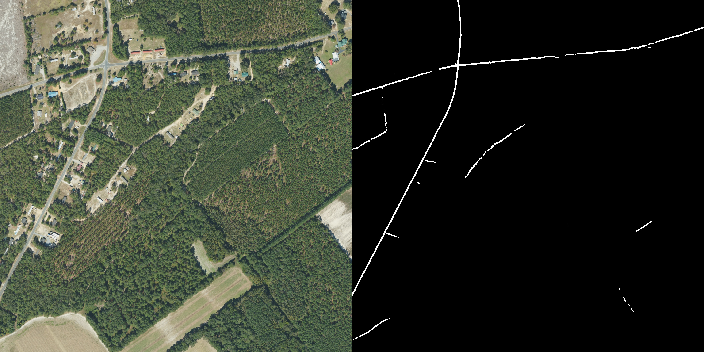

# Satellite Image Segmentation
(R) 2023 TUNG Ng.
## Installation
clone this repository
```bat 
http://gitlab.gpdn.net/tungn197/satellite-image-segmentation.git
cd satellite-image-segmentation
```
install requirements
```bat
pip install -r requirements.txt
```
Note that you have to use ```segmentation-models-pytorch==0.2.0``` because the code cannot run its latest version.

## Data preparation
For instance usage, you can download the [Massachusetts Roads Dataset](https://www.kaggle.com/datasets/balraj98/massachusetts-roads-dataset) from Kaggle.
For training, evaluating and testing, prepare your dataset following the structure bellow:
```bat
data
--dataset_name
----- main_folder
---------- test_images
------------- image1.jpg
------------- image2.jpg
---------- test_masks
------------- image1.jpg
------------- image2.jpg
---------- train_images
---------- train_masks
---------- val_images
---------- val_masks
----- label_class_dict.csv
```
Note that an image file name must be similar to its mask. For example, the image ```image1.jpg``` must have the mask ```image1.jpg```

## Configurations
All arguments are currently put in the ```Configs()``` class, just modify it. There are the explaination of some arguments
* self.training (bool): True if training model
* self.testing (bool): True if testing model
* self.inference (bool): True if infering images
* self.pretrained (bool): If the same model exists, load and continue to train it.
* self.class_dict = path/to/label_class_dict.csv
* self.data_dir = path to the ```main_folder``` in the example in the [Data preparation](##-Data-preparation) section
* self.target_objects: objects you want to segment (note that it must exist in the ```label_class_dict.csv```)
* self.sample_folder: path to the folder for inference
* self.save = save the results (test logs and infered images)

## Running
Just run
```bat
python main.py
```
There are some results of the UNet with ResNet-101 encoder for road segmentation task



